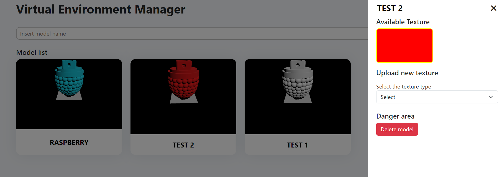
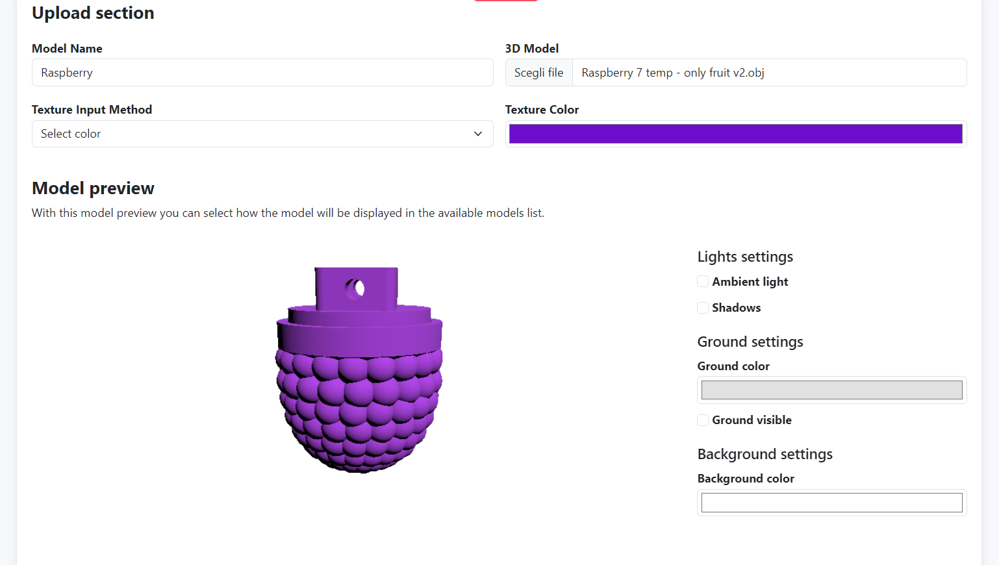

# Virtual Environment - User Interface

## Introduction
With this user interface you will be able to easily manage the models and the textures for the virtual environment.  
With it you can:
- Manage the models and the textures (CRUD operations)
- See a preview of the models and textures
- Select the active object that is displayed in the scene

The main goal of this interface is to make it easy to manage the models and the texture without requiring to interact directly with the server and / or the virtual environment.

## Quick start
It's highly recomended to install this repository directly with the [server](https://gitlab.epfl.ch/create-lab/sensing-with-vr/server) installer.  
If you wish to install this user interface with your servers you should modify the parameters in the file <code>settigs.js</code>.

## Code structure
Here the structure of the code is listed with a brief description of each file.  
The third party libraries used are described in the **Third Party Libraries** section.   
The structure of the code is the following:
- <code>index.html</code>: This is the main file of the user interface.
- <code>new-model.html</code>: This is the file that can be used to upload new models.
- <code>error-pages</code>: This folder contains all the error pages.
- <code>assets/css</code>
    - <code>main.css</code>: This file contains all the css code used both in <code>index.html</code> and <code>new-model.html</code>
    - <code>index.css</code>: This file contains all the css code that is used only in <code>index.html</code>
    - <code>new-model.css</code>: This file constains all the css code that is used only in <code>new-model.html</code>
- <code>assets/js</code>
    - <code>errorPages.js</code>: This file contains all the js code that is used in <code>error-pages</code>.
    - <code>index.js</code>: This file contains all the js code used in the page <code>index.html</code> 
    - <code>inputValidation.js</code>: This file contains all the js code used to validate the inputs.
    - <code>main.js</code>: This file contains all the js code used both in <code>index.html</code> and <code>new-model.html</code> 
    - <code>model-preview.js</code>: This file contains all the js needed to display and manage the preview of the model and of the textures. It's highly suggested to use the functions in this file if you don't need to interact directly with <code>three.js</code>
    - <code>new-model.js</code>: This file contains all the js code needed from the page <code>new-model.html</code>.
    - <code>settings.js</code>: This file contains all the settings of the user interface. It contains some of the settings that should be set before deploying the application.

## Third party libraries
Here are listed all the third party libraries used and their website:
- [Bootstrap v.5.3.0](https://getbootstrap.com/)
- [Jquery v. 3.6.4](https://jquery.com/)
- [Fontawesome v. 6.3.0](https://fontawesome.com/): Icons
- [Three.js](https://threejs.org/): This is used for showing the model preview and generating the preview images

## Screenshoots
### **Model list preview**

### **New model upload**

## Authors
This repository is part of the project *"Mixed Reality Environment For Harvesting Study"* done by Alessandro Dalbesio. 
The project has been done in the CREATE LAB (EPFL). 
Professor: Josie Hughes 
Supervisor: Ilic Stefan 

## License
This project is under **MIT** license.  

