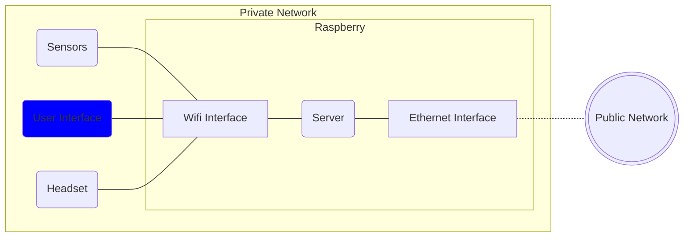

# Virtual Environment - User Interface

## Introduction
This is the User Interfaces that can be used to manage easily the virtual environment.   
With this interface you can:
- Manage models and textures (upload, update, delete)
- See a preview of your models and textures
- Select the active object in the scene
- Set the parameters of the real system

Below are displayed all the components of the virtual environment:

## Models formats supported
Here are listed all the models formats currently supported by this user interface
- <b>.obj</b>

If you want to add new extension you should modify both this user interface , the server (you can find the default one [here](https://gitlab.epfl.ch/create-lab/sensing-with-vr/server)) and the virtual environment (you can find the default one [here](https://gitlab.epfl.ch/create-lab/sensing-with-vr/virtual-environment)).

## Texture formats supported
Here are listed all the textures formats currently supported by this user interface
- <b>color</b>
- <b>.png</b>, <b>.jpg</b> and <b>.jpeg</b>

If you want to add new extension you should modify both this user interface , the server (you can find the default one [here](https://gitlab.epfl.ch/create-lab/sensing-with-vr/server)) and the virtual environment (you can find the default one [here](https://gitlab.epfl.ch/create-lab/sensing-with-vr/virtual-environment)).

## Installation
It's highly recomended to install the user interface with the server. Its documentation can be found [here](https://gitlab.epfl.ch/create-lab/sensing-with-vr/server).   
If you want to install the user interface by yourself clone this repository in your destination folder and modify the parameters in the <code>settings.js</code> file.   
Remember that even if you install the user interface on another device you still need a working server as back-end.

## Limitations
Only one user can be connected per time.  
This limitation has been imposed server-side to avoid concurrent modifications.  
If you wish to have multiple users connected at the same time you should consider implementing a locking mechanism with a modified version of the websocket server.  
You can find the default websocket server implementation [here](https://gitlab.epfl.ch/create-lab/sensing-with-vr/websocket-server).

## Authors
This repository is part of the project *"Mixed Reality Environment For Harvesting Study"* done by Alessandro Dalbesio. 
The project has been done in the CREATE LAB (EPFL). 
Professor: Josie Hughes 
Supervisor: Ilic Stefan 

## License
This project is under [MIT] license

