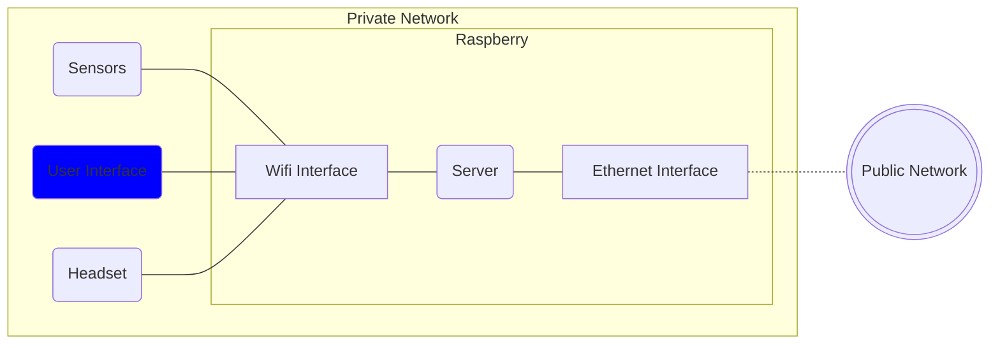

# Virtual Environment - User Interface

## Introduction
This user interface can be used to manage easily the virtual environment.  
This is the default virtual environment user interface that is installed when the [server](https://gitlab.epfl.ch/create-lab/sensing-with-vr/server) is installed with the <code>setup.sh</code> file.  
With this interface you can:
- Manage the models and the textures (upload, update and delete)
- See a preview of the models and textures
- Select the active object that is displayed in the scene

Below are displayed all the components of the virtual environment:

## Code structure
Here the structure of the code is listed with a brief description of each file.  
The third party libraries used are described in the **Third Party Libraries** section.   
The structure of the code is the following:
- <code>index.html</code>: This is the main file of the user interface.
- <code>new-model.html</code>: This is the file that can be used to upload new models.
- <code>error-pages</code>: This folder contains all the error pages.
- <code>assets/css</code>
    - <code>main.css</code>: This file contains all the css code used both in <code>index.html</code> and <code>new-model.html</code>
    - <code>index.css</code>: This file contains all the css code that is used in <code>index.html</code>
    - <code>new-model.css</code>: This file constains all the css code that is used in <code>new-model.html</code>
- <code>assets/js</code>
    - <code>errorPages.js</code>: This file contains all the js code that is used in <code>error-pages</code>.
    - <code>index.js</code>: This file contains all the js code used in the page <code>index.html</code> 
    - <code>inputValidation.js</code>: This file contains all the js code used to validate the input.
    - <code>main.js</code>: This file contains all the js code used both in <code>index.html</code> and <code>new-model.html</code> 
    - <code>model-preview.js</code>: This file contains all the js needed to display and manage the preview of the model and of the textures. It's highly suggested to use the functions in this file if you don't need to interact directly with <code>three.js</code>
    - <code>new-model.js</code>: This file contains all the js code needed from the page <code>new-model.html</code>.
    - <code>settings.js</code>: This file contains all the settings of the user interface. It contains some of the settings that should be set before deploying the application.

## Installation
This repository shouldn't be installed directly and it should be used the [server](https://gitlab.epfl.ch/create-lab/sensing-with-vr/server) installer (which is <code>setup.sh</code>).

## Limitations
Only one user can be connected per time.  
This limitation has been imposed server-side to avoid concurrent modifications.  
If you wish to have multiple users connected at the same time you should consider implementing a locking mechanism with a modified version of the websocket server.  
You can find the default websocket server implementation [here](https://gitlab.epfl.ch/create-lab/sensing-with-vr/websocket-server) which can be a good starting point.

## Third party libraries
Here are listed all the third party libraries used and their website:
- [Bootstrap v.5.3.0](https://getbootstrap.com/)
- [Jquery v. 3.6.4](https://jquery.com/)
- [Fontawesome v. 6.3.0](https://fontawesome.com/): Icons
- [Three.js](https://threejs.org/): This is used for showing the model preview and generating the preview images
- [Socket.io client](https://socket.io/): This is used for the websocket communication with the server

## Authors
This repository is part of the project *"Mixed Reality Environment For Harvesting Study"* done by Alessandro Dalbesio. 
The project has been done in the CREATE LAB (EPFL). 
Professor: Josie Hughes 
Supervisor: Ilic Stefan 

## License
This project is under **MIT** license.  

